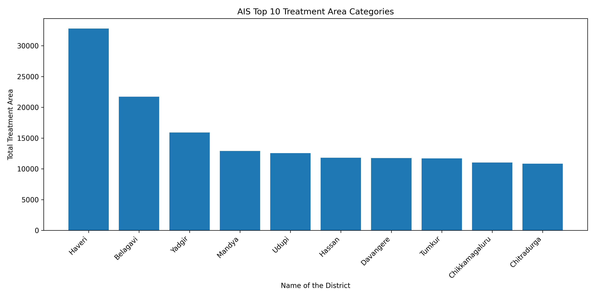

# Smart Watershed Treatment Area Planning and Resource Allocation System  
## Project Overview

The **Smart Watershed Treatment Area Planning and Resource Allocation System** is a machine learning-based project designed to analyze and predict the approved watershed treatment area under the PMKSY-WDC scheme.

This project uses district, project, and taluk-level data to estimate the **approved project area for treatment in hectares** and helps identify high-priority regions for watershed planning and resource allocation.

---

## Project Objective

The main objective of this project is to support smart decision-making in watershed development by predicting treatment area requirements and identifying important regional patterns.




---

## Dataset

**Dataset Name:** `PMKSY_WDC_treatablearea_0_14.csv`

**Target Column:**

```text
Approved Project area for treatment (in ha)
Problem Statement

To build a predictive system that can estimate the approved watershed treatment area based on available project and location-related features.

This is a regression-based machine learning project.

Technologies Used
Python
Pandas
NumPy
Matplotlib
Scikit-learn
TensorFlow / Keras
YAML
JSON
Pickle
Machine Learning Models Used
Random Forest Regressor
Decision Tree Regressor
Linear Regression
Artificial Immune System based Feature Selection
Neural Network Model
AIS Algorithm

The project uses an Artificial Immune System inspired feature selection approach.

AIS helps select the most useful features from the dataset before training the machine learning models. This improves model performance and reduces unnecessary feature complexity.

Generated Output Files
ais_result.csv
ais_prediction.csv
ais_accuracy_graph.png
ais_comparison_graph.png
ais_result_graph.png
ais_prediction_graph.png
ais_heatmap.png
ais_category_graph.png
ais_convergence_graph.png
ais_h5_loss_graph.png
ais_best_model.pkl
ais_model.h5
ais_nn_preprocessor.pkl
ais_target_scaler.pkl
ais_selected_features.json
ais_results.json
ais_config.yaml
ais_sample_prediction.json
Visual Outputs
AIS Category Graph

The AIS category graph shows the top treatment area categories based on total approved watershed treatment area.

ais_category_graph.png
Other Graphs
ais_accuracy_graph.png
ais_comparison_graph.png
ais_result_graph.png
ais_prediction_graph.png
ais_heatmap.png
ais_convergence_graph.png
ais_h5_loss_graph.png
Model Evaluation Metrics

The models are evaluated using:

R2 Score
Accuracy Percentage
Mean Absolute Error (MAE)
Root Mean Squared Error (RMSE)
Project Workflow
Load PMKSY watershed treatment dataset
Clean missing and duplicate values
Detect target column
Separate categorical and numerical features
Apply AIS-based feature selection
Train regression models
Compare model performance
Save predictions and results
Generate graphs and visualizations
Save models in .pkl and .h5 formats
Save configuration in .json and .yaml formats
How to Run
Install the required libraries
pip install pandas numpy matplotlib scikit-learn tensorflow pyyaml
Run the Python file
python ais_watershed_project.py
Project Folder Path
C:\Users\NXTWAVE\Downloads\Smart Watershed Treatment Area Planning and Resource Allocation System
Applications
Watershed treatment planning
Government resource allocation
District-wise treatment area analysis
Taluk-level priority identification
Agricultural land development planning
Sustainable water resource management
Conclusion

This project provides a smart machine learning solution for predicting and analyzing watershed treatment areas. By using AIS-based feature selection and regression models, the system helps identify important regions and supports better planning for watershed development and resource allocation.

Author

Sagnik Patra
